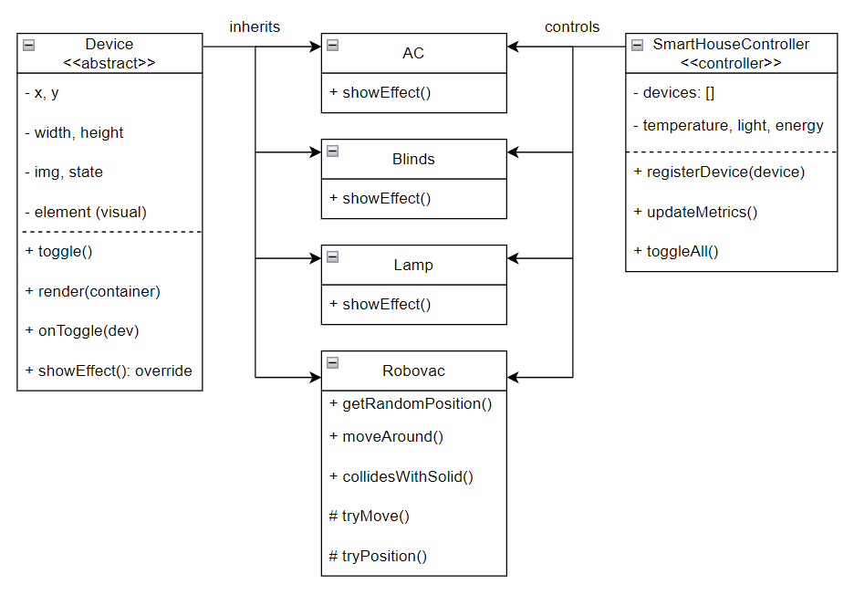
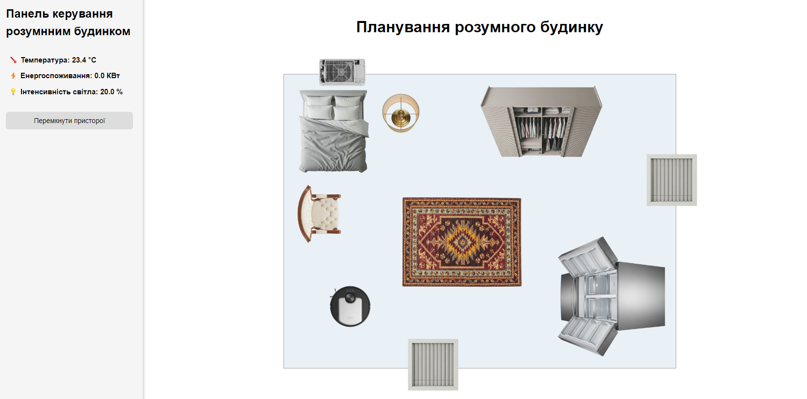
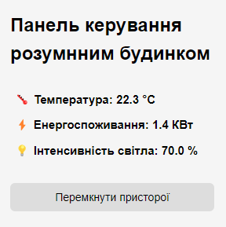
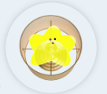
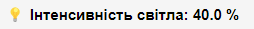
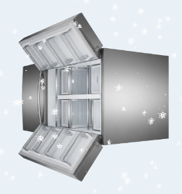
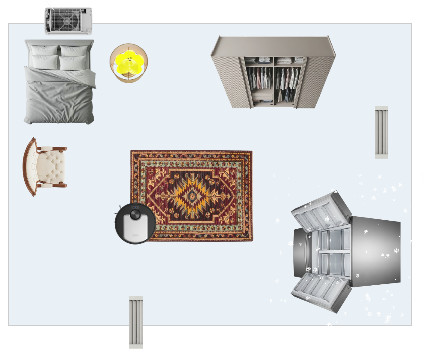

# Звіт проєкту «Розумний дім» 🏠
### За завданням: розробити архітектуру програмного забезпечення, яка реалізує моделювання системи управління компонентами "розумного будинку".

## План звіту 📝:
1. [Які сутності є + діаграма (UML) з поясненням](#які-сутності-є--діаграма-uml-з-поясненням-)
2. [Демонстрація роботи](#демонстрація-роботи-)
3. [Реалізація інкапсуляції](#реалізація-інкапсуляції-)
4. [Реалізація наслідування](#реалізація-наслідування-)
5. [Реалізація зв'язків](#реалізація-звязків-)
6. [Реалізація поліморфізму](#реалізація-поліморфізму-)

## Які сутності є + діаграма (UML) з поясненням 🧱

| Сутність                                |      Опис        |
| :-------------------------------------------| :--------------- |
| `Device`                                    | Базовий прототип для всіх пристроїв у будинку. Він визначає основні властивості (положення, розмір, зображення, стан) та базові функції, як перемикання стану та візуалізація об'єкту. |
| `Lamp`, `AC`, `Fridge`, `Blinds`, `Robovac` | Конкретні типи пристроїв, що успадковуються від `Device`, їх можна перевизначити та розширити у поведінці (наприклад, `Fridge` може відображати ефект снігу). |
| `SmartHouseController`                      | Відстежує показники стану кімнати, такі як температура, освітлення, енергія, та виконує операцію увімкнення/вимкнення всіх пристроїв. |

### UML-діаграма:



[**До початку**](#звіт-проєкту-розумний-дім-)

## Демонстрація роботи 🎨

При запуску на сторінці відобразиться планування та панель керування розумного будинку. По центру розташована карта кімнати, що заповнена меблями та вбудованими пристроями: лампа, кондиціонер, жалюзі, робот-пилосос та холодильник.



Зліва на панелі можна побачити показники температура, споживання енергії та рівень освітлення, які динамічно оновлюються на основі стану кожного пристрою



Користувач може натиснути на будь-який пристрій, щоб перемикати його стан. Наприклад, натискання на лампу візуально її увімкне та збільшить показник яскравості на панелі керування.




Деякі пристрої мають візуальні ефекти — увімкнення холодильника накладає на його контейнер анімований ефект снігу, імітуючи охолодження.



Натискання кнопки «Перемикати все» послідовно змінює стан та анімацію кожного пристроя, оновлюючи показники на панелі керування.



[**До початку**](#звіт-проєкту-розумний-дім-)

## Реалізація інкапсуляції 🔒

### Як це зроблено в моєму проєкті:
1. Властивості об'єкта зберігаються всередині конструкторів:
```js
function Device(x, y, width, height, img) {
    this.x = x;
    this.y = y;
    this.width = width;
    this.height = height;
    this.img = img;
    this.state = 'off';
    this.element = null;
}

```

2. Поведінка групується з даними за допомогою прототипних методів:
```js
Device.prototype.toggle = function () {
    this.state = this.state === 'on' ? 'off' : 'on';
    if (typeof this.onToggle === 'function') this.onToggle(this);
    if (typeof this.showEffect === 'function') this.showEffect();
};

```

3. Взаємодія відбувається тільки через визначені інтерфейси:
	- Зовнішній код **не отримує доступ і не змінює внутрішній** `element`, `state` **тощо безпосередньо**.
	- Зміни стану відбуваються тільки через `.toggle()` або `.render()`, зберігаючи цілісність.

4. SmartHouseController інкапсулює управління пристроями:
	- Масив пристроїв є приватним для екземпляра контролера.
	- Пристрої необхідно реєструвати, використовуючи `registerDevice(device)`, а не додавати вручну.
	- Обчислення стану кімнати відбуваються через `updateMetrics()` — інші модулі не можуть безпосередньо змінювати дані показників.


[**До початку**](#звіт-проєкту-розумний-дім-)

## Реалізація наслідування 🧬

### Щоб відповідати принципам ES5 успадкування було здійснено шляхом присвоєння `prototype` дочірнього елемента екземпляру батьківського `prototype`, а потім скидання конструктора:
```js
function Lamp(x, y, width, height, img) {
	Device.call(this, x, y, width, height, img); // Успадкований конструктор
}
Lamp.prototype = Object.create(Device.prototype); // Успадкований метод
Lamp.prototype.constructor = Lamp;

```

Цю схему було реалізовано для інших підкласів, як `AC`, `Fridge`, `Robovac` та `Blinds`.

[**До початку**](#звіт-проєкту-розумний-дім-)

## Реалізація зв'язків 🔗

### Що було використано:

1) SmartHouseController <-> Devices -> **Агрегація**
	- Контролер **керує** пристроями (`this.devices.push(device)`).
	- Пристрої існують **незалежно** і можуть бути створені без контролера.
	- Контролер **викликає** методи на пристроях, але не «володіє» ними.
```js
SmartHouseController.prototype.registerDevice = function (device) {
	this.devices.push(device);
};

```

2) Device <-> Елемент DOM -> **Композиція**
	- `Device` створює та повністю керує своїм візуальним представленням (`this.element`).
	- Якщо пристрій видалено, його елемент DOM також буде видалено.
```js
Device.prototype.render = function (container) {
	var el = document.createElement('div');
	el.className = 'device';
	el.style.left = this.x + '%';
	el.style.top = this.y + '%';
	el.style.width = this.width + 'px';
	el.style.height = this.height + 'px';
	el.style.backgroundImage = 'url(' + this.img + ')';

	el.addEventListener('click', this.toggle.bind(this));
	this.element = el;

	container.appendChild(el);
};

```

3) Device <-> onToggle callback -> **Асоціація**
	- Пристрої вільно асоціюються з контролером або іншою логікою за допомогою callback.
	- Може бути перепризнечим ззовні (`device.onToggle = function(dev) { ... }`).

[**До початку**](#звіт-проєкту-розумний-дім-)

## Реалізація поліморфізму 🎭

### Як було зроблено:
Всі пристрої успадковують від `Device`, тому його функції можна викликати:
```js
device.toggle();
device.render(house);  // Однакова назва методу, різні візуальні елементи

```

Опціональна функція `showEffect()` є поліморфною:
Визначена для `Fridge` та інших пристроїв, яким вона потрібна.
Безпечно викликається з `toggle()`:
```js
Device.prototype.toggle = function () {
	this.state = this.state === 'on' ? 'off' : 'on';
	if (typeof this.onToggle === 'function') this.onToggle(this);
	if (typeof this.showEffect === 'function') this.showEffect();
};

```

[**До початку**](#звіт-проєкту-розумний-дім-)
